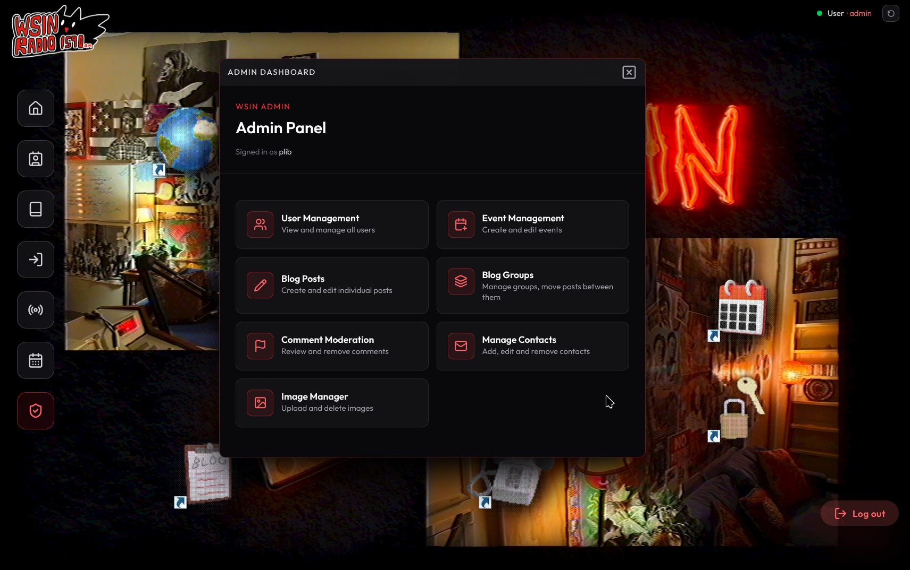
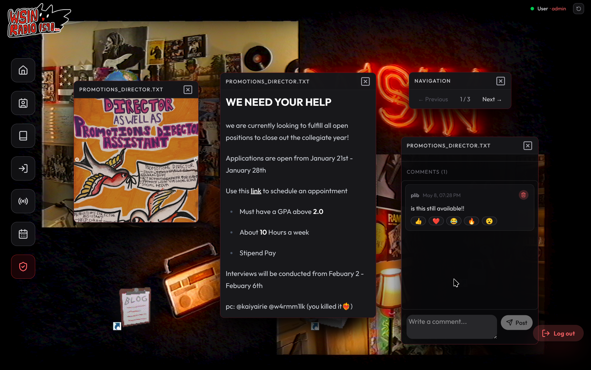
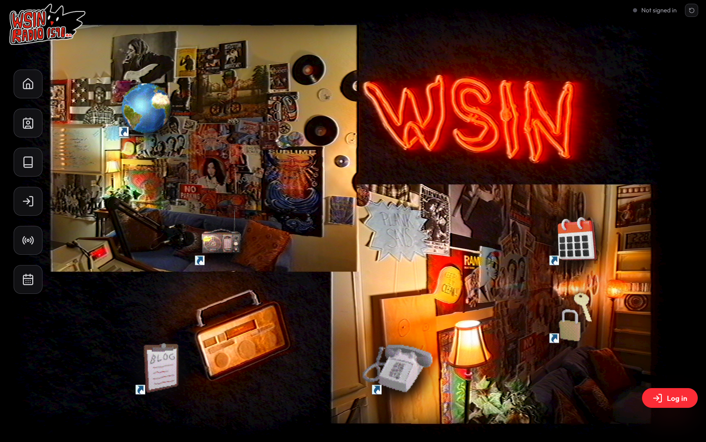

# WSIN 1590 AM — Student Radio Website

The official web presence for **WSIN Radio**, Southern Connecticut State University's student-run radio station, broadcasting from Room 210 in the Adanti Student Center.

---

## 1. Project Description

WSIN is a full-stack web application that gives the station a single home for its listeners and contributors. Visitors can stream the live broadcast, read student-written blog posts, RSVP to upcoming events, chat in real time during shows, and reach out to station members. Admins get a moderation dashboard for managing users, posts, comments, events, contacts, and uploaded images.

The interface is built around a draggable "desktop" aesthetic: each section (Blog, Events, Radio, Contacts, etc.) opens in its own movable window, with floating 3D-style icons that double as shortcuts.

**Key features**
- User accounts with email verification + password reset (JWT auth)
- Live radio stream player with listener count and now-playing metadata
- Real-time live chat via Socket.IO with admin host/moderation controls
- Blog posts organized into admin-managed groups
- Events with one-time and recurring (weekly/biweekly) schedules and RSVPs
- Threaded comments with emoji reactions and a flag-for-moderation system
- Contacts directory of station members
- Admin image upload + asset library
- Draggable, resizable windowing UI with hover labels and floating shortcuts
- Animated intro and ambient background video

---

## 2. Team Members

| GitHub | Contributions |
|--------|---------------|
| **uskokova1** | Project lead — initial scaffolding, blog system, contacts, events, RSVP, admin dashboard backbone |
| **munkE-dev** | Live chat (Socket.IO), background animations, intro video, calendar widget, UI polish |
| **stonedscone** | Sidebar + draggable window system, comment moderation, blog groups, admin sub-pages, server-side bug fixes |

---

## 3. Technologies Used

**Frontend**
- React 19 + Vite 7
- Tailwind CSS v4 + shadcn/ui components
- React Router v7
- Motion (Framer Motion) for animations
- react-moveable for draggable windows
- react-day-picker for the events calendar
- Socket.IO client for live chat
- Axios for HTTP, react-toastify for notifications
- Lucide React + Hugeicons for iconography

**Backend**
- Node.js + Express 5
- MongoDB + Mongoose
- Socket.IO server (live chat, host status)
- JSON Web Tokens + bcrypt (auth)
- Multer (file uploads)
- Nodemailer (verification + reset emails via Gmail SMTP)
- express-rate-limit (basic abuse protection)
- HTTPS dev server via `mkcert`

**Tooling**
- ESLint, dotenv, Vite HMR, Git/GitHub

---

## 4. Installation Instructions

### Prerequisites
- **Node.js 18+**
- **MongoDB** (local instance or a free MongoDB Atlas cluster)
- **mkcert** (already trusted; the repo ships with `localhost+1.pem` / `localhost+1-key.pem` for local HTTPS)
- A **Gmail App Password** if you want verification/reset emails to send (optional for local dev)

### Clone the repo
```bash
git clone https://github.com/uskokova1/RadioWebsite.git
cd RadioWebsite
```

### Install backend dependencies
```bash
cd server
npm install
```

Create `server/.env`:
```env
DB_URI=mongodb://localhost:27017/wsin
ACCESS_TOKEN_SECRET=<long-random-string>
REFRESH_TOKEN_SECRET=<another-long-random-string>
NODE_ENV=development
EMAIL=your.gmail@gmail.com
EMAIL_PWD=<16-char Gmail App Password>
```

### Install frontend dependencies
```bash
cd ../client/radio
npm install
```

Create `client/radio/.env`:
```env
VITE_BACKEND_URL=https://localhost:8443
```

---

## 5. Running the Application

Open **two terminals**:

**Terminal 1 — backend** (HTTPS on port 8443)
```bash
cd server
node index.js
```

**Terminal 2 — frontend** (Vite on port 5173)
```bash
cd client/radio
npm run dev
```

Then open **https://localhost:5173** in your browser.

> The first time you visit, your browser may warn about the self-signed certificate — click **Advanced → Proceed**. Both the frontend (5173) and backend (8443) need to be trusted.

**First-time setup**
1. Click the `1590 AM` button to play the intro animation.
2. Use the *User Login* sidebar icon to register an account.
3. To get admin access, manually set `role: "admin"` on your user document in MongoDB.

---

## 6. Deployment

Currently the site runs locally over HTTPS with `mkcert`-issued certificates. The codebase is structured so the two halves can be deployed independently:

- **Backend** (`server/`) is a stateless Node app that connects to MongoDB. It can be deployed to any Node host — **Render**, **Railway**, **Fly.io**, or a self-managed VPS. It needs MongoDB connectivity and the env vars listed above. Replace the dev `mkcert` certs with proper TLS (or terminate TLS at a reverse proxy / platform).
- **Frontend** (`client/radio/`) builds to a static bundle via `npm run build`. It can be hosted on **Vercel**, **Netlify**, **Cloudflare Pages**, or any static-file host. Set `VITE_BACKEND_URL` at build time to point at the deployed backend.
- **Database**: a free **MongoDB Atlas** cluster works for both staging and a small-scale demo deployment.

Socket.IO requires that the deployment host supports WebSocket upgrades; all the platforms listed above do.

---

## 7. Screenshots

### Home — draggable windowed interface


### Blog reader with comments


### Admin dashboard

